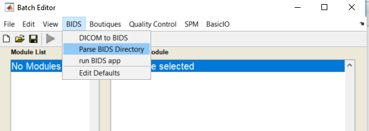
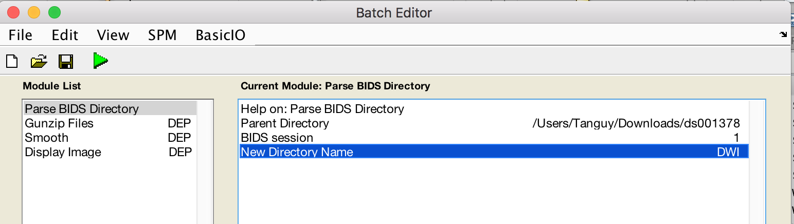
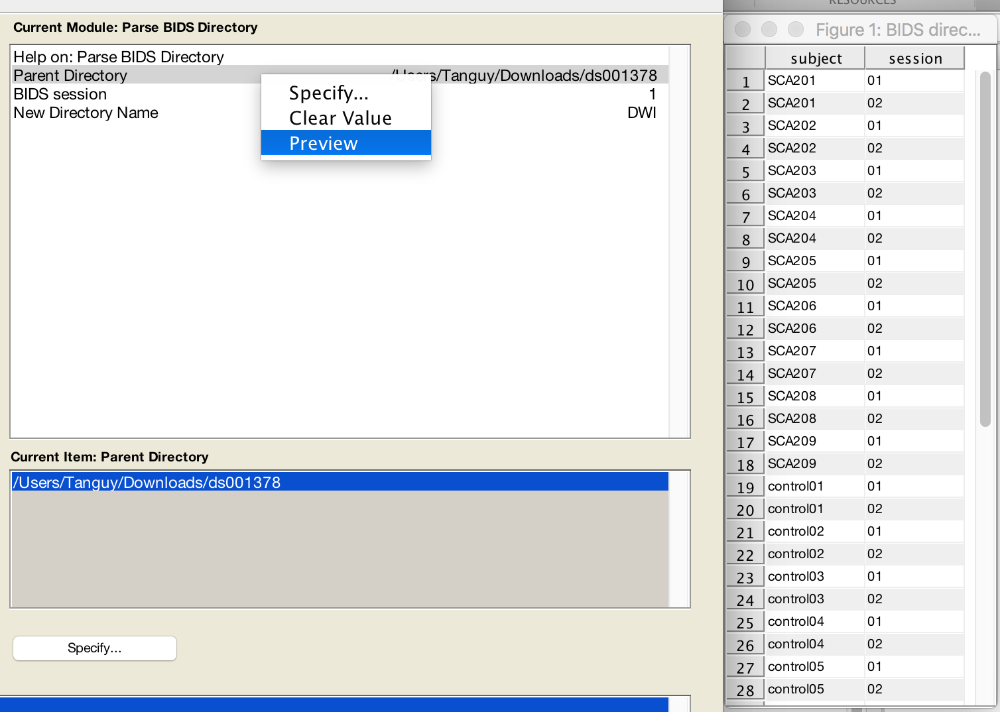
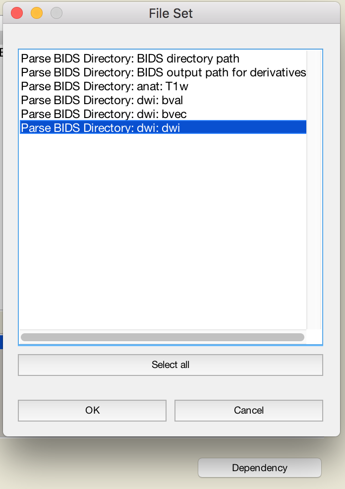
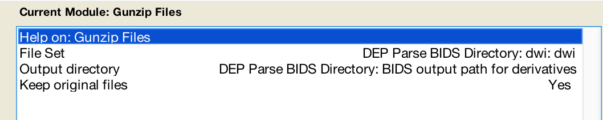
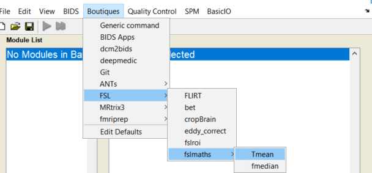
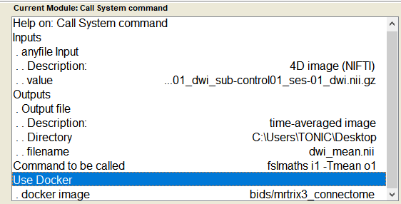
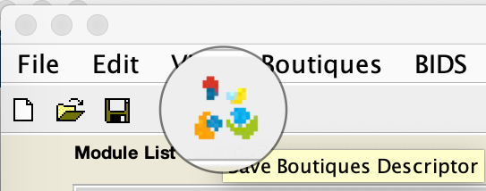
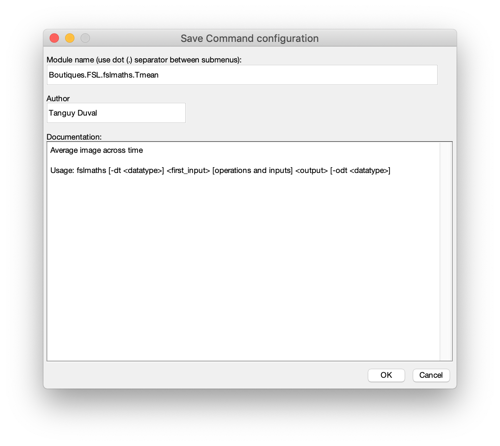

This repository includes the following spm apps:
  * **BIDS**: for dicom to BIDS conversion and for parsing a BIDS folder. BIDS is the standard for neuroimaging data organization: http://bids.neuroimaging.io
  * **Boutiques**: for running any dockerized neuroimaging tool (e.g. FSL, Freesurfer, ANTs, ...). Boutiques is the standard describing these tools https://boutiques.github.io/
  * **Quality Control**: includes a module for exporting nifti results as an interactive Html page and an advanced Nifti viewer with ROI tools (for drawing a mask).

## Documentation

* [Installation](#install)
* [Features](#features)
	- [BIDS parser module: create a participant BIDS pipeline in just a minute](#bids-parser-module)
	- [Boutiques (run FSL, ANTS, Freesurfer, ... or any command)](#boutiques)
  
## INSTALL
  1. Install spm12 if you don't have it: https://www.fil.ion.ucl.ac.uk/spm/software/spm12/
  2. [R2014b or later] **Copy-Paste** in your Matlab command line:
````matlab
% CHANGE DIRECTORY to default Matlab path
if isempty(userpath), userpath('reset'); end
cd(userpath)
% DOWNLOAD spm-apps
websave('spm12-apps.zip','https://github.com/tanguyduval/spm12-apps/archive/master.zip')
unzip spm12-apps.zip
% ADD to Matlab path
addpath(fullfile('spm12-apps-master','BIDS'))
addpath(fullfile('spm12-apps-master','Boutiques'))
addpath(fullfile('spm12-apps-master','QualityControl'))
savepath
% RUN spm Batch Editor
cfg_util('initcfg')
cfg_ui
````

[R2014a or older] In spm Batch Editor: 
`File-->Add Application-->select cfg_mlbatch_appcfg.m` in each folder

## FEATURES
### BIDS parser module
   *create a participant BIDS pipeline in just a minute*
  - download an example BIDS dataset: https://openneuro.org/datasets/ds001378/versions/00003
  - open the matlabbatch using command `cfg_ui`
  - **Add** a new module Parse BIDS
  
  
  - **Fill** module as follows
  
  
  - **Preview** your BIDS dataset
  
  
  - add a new module BasicIO>FileOperation>Gunzip files
  - Use the **dependency** button and select one modality (e.g. dwi) and fill as follows
  
  
  
  
  - Add additional modules or just click the **run** icon. Subject 1 session 1 will be processed.  
  Results will be saved into `bidsfolder/derivatives/matlabbatch/sub-NAME/ses-SESSION/DWI/`
  - Click on the **run for all subjects** icon (double play icon) to loop across all subjects/sessions
  - **Save** your single participant pipeline using the save icon into a m-file
  - **Share** your pipeline. 
  
### Boutiques
*(run FSL, ANTS, Freesurfer, ... or your own app)*
  - install and run docker (https://www.docker.com/get-started). highly recommanded. 
  *Note: On windows 8 and older, install docker toolbox: https://docs.docker.com/toolbox/toolbox_install_windows/*
  
##### Use pre-existing Boutiques files
  - Download a 4D image https://openneuro.org/crn/datasets/ds001378/snapshots/00003/files/sub-control01:ses-01:dwi:sub-control01_ses-01_dwi.nii.gz
  - open the Batch Editor using command `cfg_ui`
  - **Use** a fslmaths>Tmean module to average across time:
  
  
##### Create a Custom Boutiques file
- **Add** a new Generic module  
  - **Fill** the module as follows  
       *Use Docker: docker images with preinstalled neuroimaging softwares can be found on https://hub.docker.com/   
                   `bids/mrtrix3-connectome` includes ANTS MRtrix3 and FSL
                   docker images will be automatically downloaded and inputs/output folders mounted  
                   if you choose "NO", command will be run locally*  
  
   
   - **RUN** the command using the green play button
   - **Save** your preset module as a Boutiques descriptor https://boutiques.github.io<br/>
  <br/>
  
  
  
  - **Reload** modules
````matlab
cfg_util('initcfg')
cfg_ui
````
  - **Use** your preset module in an other pipeline
  

  - Your preset is saved under `spm-apps\Boutiques\Boutiques`  
